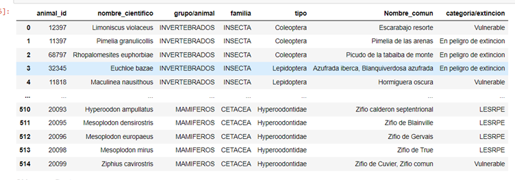
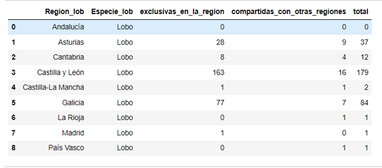
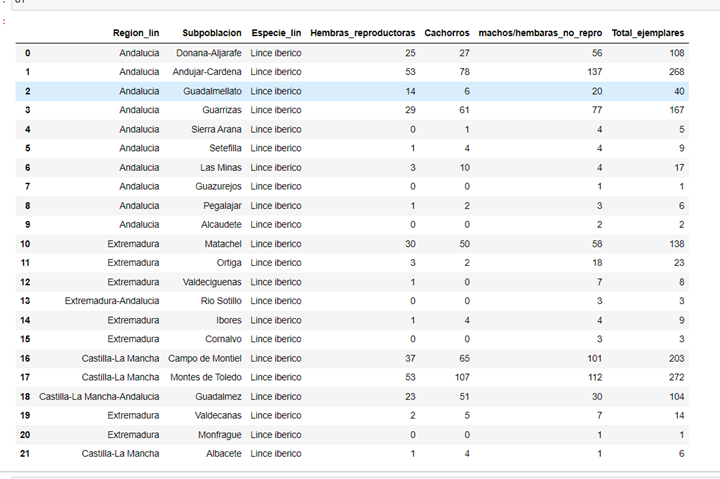
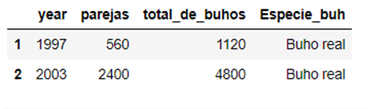
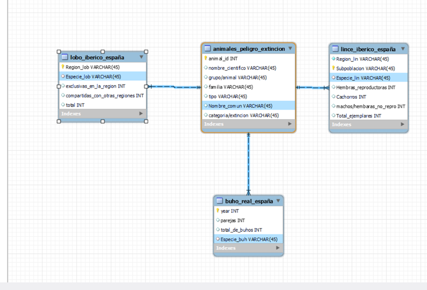

# Proyecto de ETL (Animales en peligro de extincion en España)

## Tabla de contendio

-[Descripcion](#descripcion)

-[Url](#url)

-[metodos-extraccion](#metodos-de-extraccion)

-[Python](#python)

-[SQL](#sql)

## Descripcion 

En este proyecto he decidido coger los animales en peligro de extincion que hay en España y crear una tabla para asi poder ver en que situacion esta cada uno. aparte de esto me he focalizado en el lice, lobo y el buho real donde he podido sacar alguna informacion de la poblacion por comunidades tanto en el lobo como en el lince y por años desde la ultima vez que se registro en internet en el caso del buho real

## Url
**url1** https://www.miteco.gob.es/es/biodiversidad/temas/conservacion-de-especies/especies-proteccion-especial/ce-proteccion-listado-situacion.html 

**url2** https://lifelynxconnect.eu/censos/ 

**url3** https://www.epdata.es/datos/lobo-espana-graficos/612?accion=2 

**url4** https://www.vertebradosibericos.org/aves/habitat/bubbubha.html

## Metodos de extraccion
CSV/XLSX= **url1** y **url3**

scrapeo = **url2** y **url4**

## Python
aqui dejo unas imagenes de como me quedaron las tablas.
### animales en peligro de extincion en españa

### lobo iberico

### lince iberico

### buho real

## SQL

